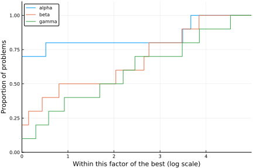
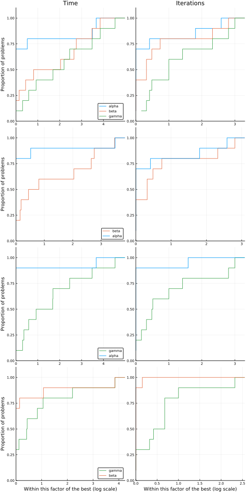

# SolverBenchmark.jl

## How to Cite

If you use SolverBenchmark.jl in your work, please cite using the format given in [CITATION.bib](https://github.com/JuliaSmoothOptimizers/SolverBenchmark.jl/blob/master/CITATION.bib).

[](https://doi.org/10.5281/zenodo.3948381)

[](https://circleci.com/gh/JuliaSmoothOptimizers/SolverBenchmark.jl)
[](https://ci.appveyor.com/project/dpo/solverbenchmark-jl)
[](https://cirrus-ci.com/github/JuliaSmoothOptimizers/SolverBenchmark.jl)
[](https://JuliaSmoothOptimizers.github.io/SolverBenchmark.jl/latest)
[](https://coveralls.io/github/JuliaSmoothOptimizers/SolverBenchmark.jl?branch=master)

This package provides general tools for benchmarking solvers, focusing on the following
guidelines:
- The output of a solver's run on a suite of problems is a `DataFrame`, where each row
  is a different problem.
  - Since naming issues may arise (e.g., same problem with different number of
    variables), there must be an ID column;
- The collection of two or more solver runs (`DataFrame`s), is a
  `Dict{Symbol,DataFrame}`, where each key is a solver;

This package is developed focusing on
[Krylov.jl](https://github.com/JuliaSmoothOptimizers/Krylov.jl) and
[JSOSolvers.jl](https://github.com/JuliaSmoothOptimizers/JSOSolvers.jl), but is
sufficiently general to be used in other places.

## Example

Obs: See the [assets](assets) folder for the complete code, or the [docs](https://JuliaSmoothOptimizers.github.io/SolverBenchmark.jl/latest) for a more detailed example.

### Example table of a single `DataFrame`

`pretty_stats(df)`

```
┌─────────────┬─────────┬───────────┬───────────┬────────┐
│        flag │    name │      f(x) │      time │   iter │
├─────────────┼─────────┼───────────┼───────────┼────────┤
│     failure │ prob001 │ -6.89e-01 │  6.24e+01 │     70 │
│     failure │ prob002 │ -7.63e-01 │  3.53e+02 │     10 │
│ first_order │ prob003 │  3.97e-01 │  7.68e+02 │     10 │
│ first_order │ prob004 │  8.12e-01 │  4.31e+01 │     80 │
│ first_order │ prob005 │ -3.46e-01 │  2.68e+02 │     30 │
│ first_order │ prob006 │ -1.88e-01 │  6.68e+01 │     80 │
│ first_order │ prob007 │ -1.61e+00 │  1.57e+02 │     60 │
│ first_order │ prob008 │ -2.48e+00 │  6.05e+02 │     40 │
│ first_order │ prob009 │  2.28e+00 │  1.36e+02 │     40 │
│     failure │ prob010 │  2.20e-01 │  8.38e+02 │     50 │
└─────────────┴─────────┴───────────┴───────────┴────────┘
```

`pretty_latex_stats(df)`


### Example table of a joined `DataFrame`

```
df = join(stats, [:status, :f, :t], ...)
pretty_stats(df, tf=markdown)
```

```
|     id |    name |  flag_alpha |   f_alpha |   t_alpha |   flag_beta |    f_beta |    t_beta |  flag_gamma |   f_gamma |   t_gamma |
|--------|---------|-------------|-----------|-----------|-------------|-----------|-----------|-------------|-----------|-----------|
|      1 | prob001 |     failure | -6.89e-01 |  6.24e+01 | first_order | -4.83e-01 |  3.92e+02 |     failure | -9.99e-01 |  6.97e+02 |
|      2 | prob002 |     failure | -7.63e-01 |  3.53e+02 | first_order | -1.16e+00 |  4.79e+02 | first_order |  1.03e+00 |  4.35e+02 |
|      3 | prob003 | first_order |  3.97e-01 |  7.68e+02 | first_order | -2.14e-01 |  6.82e+01 | first_order | -1.16e+00 |  9.86e+02 |
|      4 | prob004 | first_order |  8.12e-01 |  4.31e+01 | first_order | -1.37e+00 |  4.80e+02 | first_order |  5.34e-01 |  9.97e+02 |
|      5 | prob005 | first_order | -3.46e-01 |  2.68e+02 | first_order | -1.54e+00 |  4.68e+02 | first_order | -3.08e-01 |  5.08e+02 |
|      6 | prob006 | first_order | -1.88e-01 |  6.68e+01 | first_order | -1.23e+00 |  4.52e+02 | first_order |  9.86e-01 |  2.16e+02 |
|      7 | prob007 | first_order | -1.61e+00 |  1.57e+02 | first_order | -1.96e+00 |  6.44e+02 | first_order | -1.19e+00 |  8.59e+02 |
|      8 | prob008 | first_order | -2.48e+00 |  6.05e+02 |     failure | -4.73e-01 |  6.69e+02 | first_order |  6.80e-01 |  9.05e+02 |
|      9 | prob009 | first_order |  2.28e+00 |  1.36e+02 | first_order |  1.34e+00 |  9.48e+01 |     failure |  2.04e-03 |  4.35e+02 |
|     10 | prob010 |     failure |  2.20e-01 |  8.38e+02 | first_order |  8.08e-01 |  9.49e+02 | first_order | -4.78e-01 |  6.59e+01 |
```

`pretty_latex_stats(df)`


### Example profile

`p = performance_profile(stats, df->df.t)`



### Example profile-wall

`p = profile_solvers(stats, costs, titles)`


